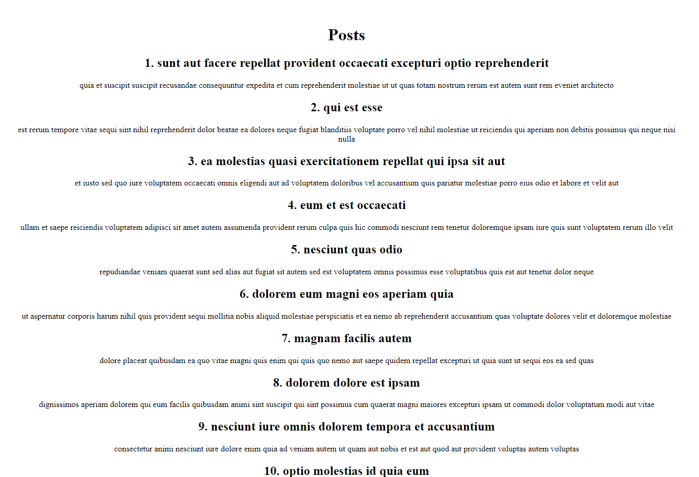
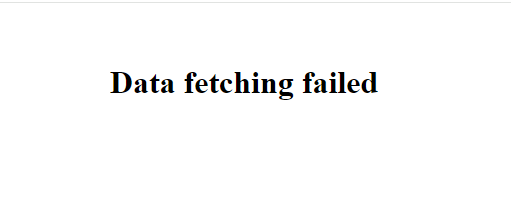

## Project Brief: DJS10 - Asynchrony

#### Objective

Dive into the asynchronous world of React by creating an application that fetches and displays blog posts from an API. You'll practice handling API calls with the Fetch API, managing application state, and gracefully handling errors.

# Project Brief

My task was to build a React application that makes HTTP GET requests to the JSONPlaceholder API to retrieve a list of dummy blog posts. The application should render the titles and bodies of these posts on the screen. I had to also implement error handling to manage unsuccessful API calls.

# Project Overview

### Requirements

1. **Project**: Create a React application

1. **API Integration**: Use the Fetch API to asynchronously fetch blog posts from `https://jsonplaceholder.typicode.com/posts`. Ensure the API response is checked—if it's not "ok", throw an error.
1. **State Management**: Store the fetched posts in the application's state. Use React hooks like `useState` and `useEffect` to manage state and side effects.
1. **Error Handling**: Catch any errors that might occur during the API call. If an error occurs, catch it and store the error message in the state instead of logging it to the console.
1. **UI Rendering**:
   - If the API call is successful, display each post's title and body in your application.
     
   - If the API call fails, display a user-friendly error message. Ensure your application does not crash.
     
1. **Testing Error States**: Simulate an error state by modifying the API URL to an incorrect address, and observe if the application correctly handles the error by displaying the appropriate message.

#### Additional Guidelines

- Prioritize clean, readable code. Make sure to separate concerns by keeping your fetching logic and UI rendering distinct.
- Comment your code where necessary to explain why certain decisions were made, especially around error handling.
- No styling is required.

#### Evaluation Criteria

- Correct implementation of asynchronous data fetching.
- Effective state management and error handling.
- Code readability and structure.
- Handling of edge cases and potential errors.

# Elements Included

- Correct implementation of asynchronous data fetching.
- Effective state management and error handling.
- Code readability and structure.
- Handling of edge cases and potential errors.

# Reflections

## Areas of Mastery

- Fetching API
- State Management - I successfully coded a solution that had effective state management

## Challenges Faced

- Honestly speaking, I didn't face any challenges.

## Areas of Improvement

- I want to consider breaking down my code into smaller, more manageable components to improve maintainability.
- Using more tools to provide solutions

# Overall Learning Experience

- I gained a deeper understanding of asynchronous data fetching and state management in React. I also learned the importance of error handling and how to implement it effectively.
